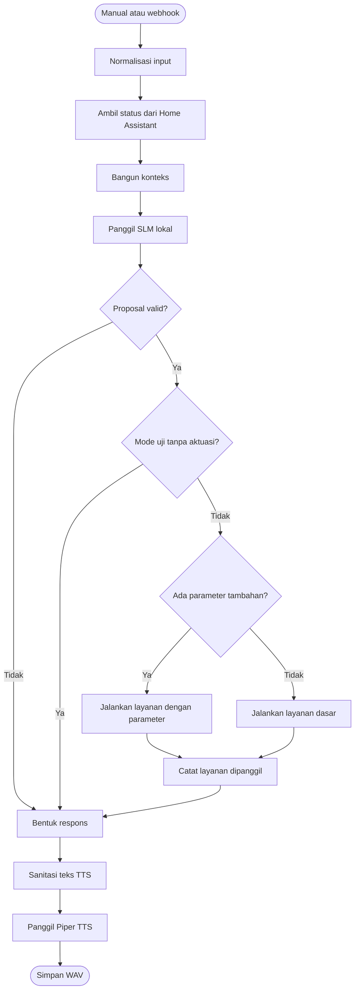

# Orkestrasi n8n

## Peran n8n

n8n mengatur alur dari teks hasil STT sampai jawaban suara. Di sinilah status perangkat dibaca, SLM dipanggil, hasil model diperiksa, perintah yang valid diteruskan ke Home Assistant, dan jawaban dikirim ke TTS. Alur dapat dimulai secara manual untuk pengujian atau melalui webhook dari layanan STT.

## Alur keputusan

## Fungsi setiap node

| No. | Node | Fungsi |
| ---: | --- | --- |
| 1 | `Manual Trigger` | Memulai pengujian tanpa perangkat suara |
| 2 | `Webhook - Voice Input` | Menerima teks hasil transkripsi dengan token pada header |
| 3 | `Code - Input` | Menyamakan format input manual dan webhook, termasuk pilihan mode uji |
| 4 | `Get many states` | Mengambil status dan atribut perangkat dari Home Assistant |
| 5 | `Code - Build Context` | Memilih perangkat yang diizinkan dan membuat ringkasan kondisi ruangan |
| 6 | `HTTP Request - Local SLM` | Mengirim konteks, permintaan pengguna, dan daftar fungsi ke SLM |
| 7 | `Code - Parse and Validate` | Membaca hasil model dan menolak perintah yang tidak sesuai aturan |
| 8 | `IF - Executable` | Memisahkan hasil yang dapat dijalankan dari hasil tanpa aksi atau yang ditolak |
| 9 | `IF - Dry Run` | Mencegah aktuasi saat pengujian |
| 10 | `IF - Has Service Data` | Menentukan apakah perintah memerlukan parameter tambahan |
| 11 | `Home Assistant - Call Service Basic` | Menjalankan layanan dasar seperti menyalakan atau mematikan perangkat |
| 12 | `Home Assistant - Call Service With Data` | Menjalankan layanan dengan parameter seperti tingkat terang, warna, atau suhu |
| 13 | `Code - Mark Service Called` | Mencatat bahwa perintah telah dikirim ke Home Assistant |
| 14 | `Code - Final Response` | Menggabungkan hasil keputusan, validasi, dan aktuasi menjadi jawaban akhir |
| 15 | `Code - Text Sanitizer for TTS` | Menghapus format yang tidak cocok dibacakan |
| 16 | `HTTP Request - Piper TTS Server` | Meminta audio WAV dari layanan TTS |
| 17 | `Read/Write Files from Disk` | Menyimpan audio agar dapat diputar oleh layanan audio lokal |
| 18–21 | `Sticky Note*` | Catatan penjelas di editor n8n; tidak ikut memproses data |

## Pemeriksaan dan Eksekusi

Sebelum perintah dijalankan, n8n memeriksa jumlah aksi, nama fungsi, perangkat tujuan, jenis nilai, dan batas nilainya. Hanya hasil yang lolos pemeriksaan yang diterjemahkan menjadi layanan atau scene Home Assistant.

!!! warning "Catatan pengembangan"
    Pembentukan konteks dan aturan `HassLightSet` perlu tetap sama dengan kontrak dataset. Tujuannya agar satu permintaan perubahan lampu tidak berubah makna ketika diteruskan ke Home Assistant.

## Screenshot yang Dibutuhkan

!!! info "Placeholder — tampilan alur n8n"
    Tambahkan screenshot seluruh canvas n8n dengan kelompok **Input**, **Context & Decision**, **Safety & Execution**, dan **Response & TTS** terlihat. Samarkan ID kredensial, URL privat, token, dan data eksekusi.

!!! info "Placeholder — node penting"
    Tambahkan screenshot parameter dari `Code - Build Context`, `HTTP Request - Local SLM`, `Code - Parse and Validate`, dan `Code - Final Response`. Gunakan data contoh anonim.
