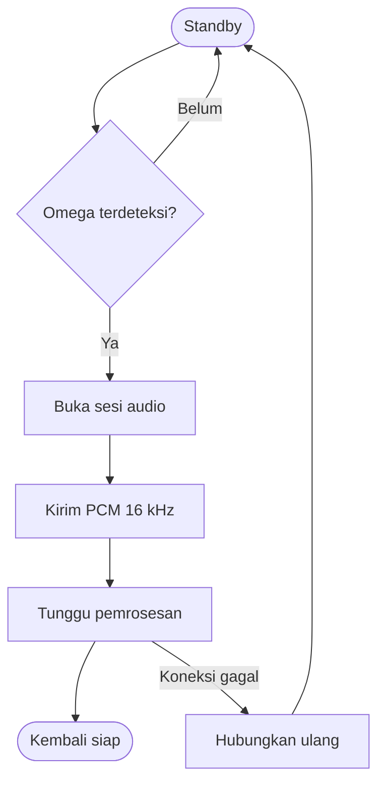

# Voice Satellite

## Tanggung jawab

Voice satellite adalah perangkat edge yang selalu siap mendeteksi wake word, membuka sesi rekaman, mengirim audio, dan memberi umpan balik LED. Pemrosesan wake word berlangsung lokal sehingga audio standby tidak perlu terus dikirim ke core node.

## Komponen

| Komponen | Fungsi |
| --- | --- |
| Raspberry Pi 3 Model B Rev 1.2 | Menjalankan voice client sebagai service |
| ReSpeaker 2-Mic HAT | Capture audio dan playback/antarmuka audio |
| `omega.tflite` | Model OpenWakeWord aktif |
| SPI status LED | Standby, listening, processing, dan error |
| Systemd service | Menjaga client aktif setelah reboot |

## Alur lokal

## Uji yang disarankan

- Recall Omega pada variasi pembicara, jarak, tempo, dan kebisingan.
- False activations per hour pada audio negatif kontinu.
- Recovery setelah Wi-Fi terputus dan setelah reboot.
- Sinkronisasi LED dengan state sesi.
- Kualitas audio 16 kHz mono pada perangkat ReSpeaker asli.

!!! info "Screenshot yang dibutuhkan"
    Tambahkan foto voice satellite lengkap dan close-up ReSpeaker/LED. Pastikan tidak ada label jaringan atau credential yang terlihat.
