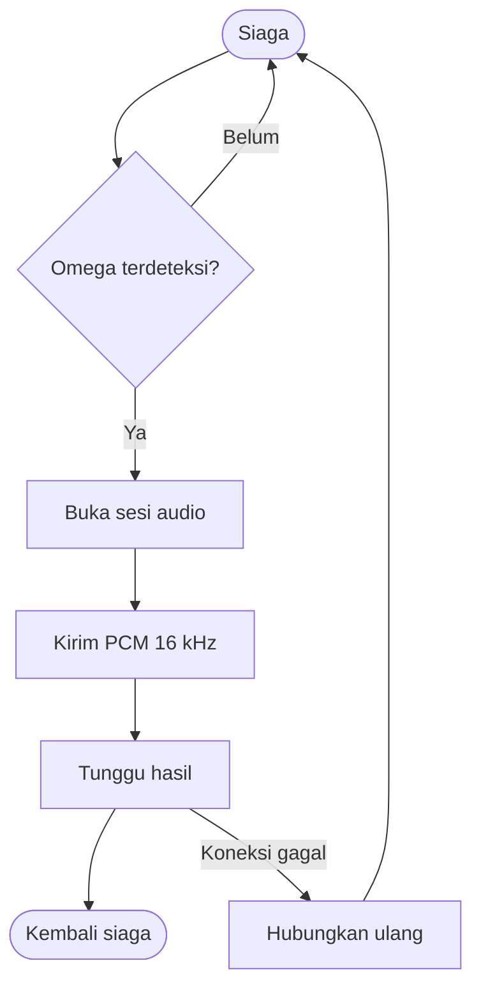
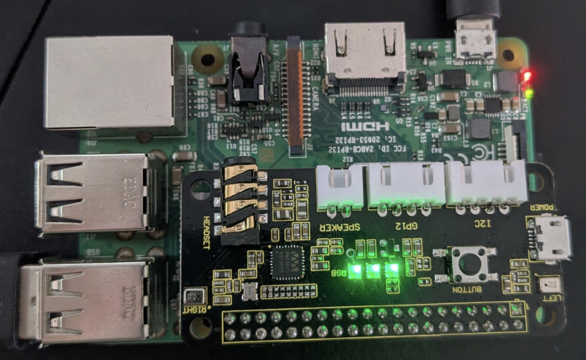

# Perangkat Suara (Raspberry Pi)

## Peran Perangkat

Raspberry Pi bertugas mendeteksi wake word, merekam suara, mengirim audio, dan menampilkan status melalui LED. Wake word diproses langsung pada Raspberry Pi sehingga audio saat siaga tidak terus-menerus dikirim ke komputer utama.

## Komponen

| Komponen | Fungsi |
| --- | --- |
| Raspberry Pi 3 Model B Rev 1.2 | Menjalankan voice client sebagai service |
| ReSpeaker 2-Mic HAT | Capture audio dan playback/antarmuka audio |
| `omega.tflite` | Model OpenWakeWord aktif |
| SPI status LED | Standby, listening, processing, dan error |
| Systemd service | Menjaga client aktif setelah reboot |

## Alur pada Raspberry Pi

## Perangkat Prototipe

<figure markdown="span">
  
  <figcaption>Raspberry Pi 3B, ReSpeaker 2-Mic HAT, dan LED status yang digunakan pada perangkat suara SmartLab.</figcaption>
</figure>
