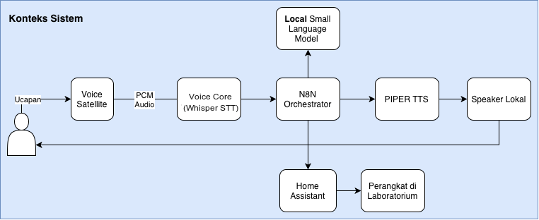

# SmartLab Private Voice Assistant

SmartLab adalah prototipe asisten suara Bahasa Indonesia untuk pengendalian dan pemantauan perangkat laboratorium. Pemrosesan suara, pengambilan keputusan, dan sintesis jawaban berjalan pada infrastruktur milik laboratorium dengan integrasi Home Assistant.

## Kemampuan Utama

- Aktivasi tanpa sentuhan melalui wake word **Omega**.
- Transkripsi ucapan Bahasa Indonesia secara lokal.
- Pemahaman perintah eksplisit dan keluhan kontekstual terbatas.
- Pemeriksaan status perangkat sebelum menentukan aksi.
- Pemeriksaan aturan sebelum perintah dikirim ke Home Assistant.
- Jawaban suara menggunakan Text-to-Speech lokal.

## Gambaran Sistem

<figure markdown="span">
  
  <figcaption>Alur utama dari pengguna, perangkat suara, pemrosesan lokal, Home Assistant, hingga jawaban melalui speaker.</figcaption>
</figure>

## Urutan Membaca

1. Mulai dari [Gambaran umum](getting-started/overview.md).
2. Pahami [Arsitektur Sistem](system/architecture.md) dan [Alur Proses](system/runtime-flow.md).
3. Buka [Orkestrasi n8n](components/n8n.md) untuk fungsi setiap node.
4. Gunakan [Pemasangan Model dan Pemulihan](operations/deployment.md) saat mengoperasikan prototipe.
5. Periksa [Model dan Evaluasi](models/dataset-evaluation.md) sebelum mengutip hasil riset.

## Isi Dokumentasi

Dokumentasi ini menjelaskan desain, komponen, cara kerja, evaluasi model, dan pengoperasian prototipe SmartLab. Kata sandi, token, alamat IP internal, ID kredensial, salinan basis data, dan konfigurasi rahasia tidak dicantumkan.
