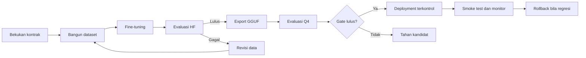

# Dataset dan Evaluasi

## Dua ruang kemampuan

Evaluasi memisahkan kemampuan baseline dan implisit agar hasil mudah dipertanggungjawabkan.

| Ruang | Fokus | Contoh |
| --- | --- | --- |
| Baseline | Perintah eksplisit dan pertanyaan status | “matikan lampu”, “berapa suhu ruangan?” |
| Implisit | Keluhan/kondisi yang membutuhkan state-aware decision | “ruangan panas”, “terlalu silau” |

Hasil baseline tidak dicampur dengan hasil implisit. Setiap laporan harus menyebut split, denominator, format model, runtime, dan evaluator.

## Desain dataset implisit

Dataset aktif memiliki 12.000 train, 1.200 development, dan 1.200 frozen test. Setiap split seimbang 50% execute dan 50% no-tool. Kategori utama meliputi explicit recall, pure implicit, status, already-state, dan refusal.

Variasi ujaran mencakup:

- Short nonformal: “suhu ruangan panas”.
- STT fragment: “terlalu silau”.
- Conversational: “ruangannya terasa dingin”.
- Contextual natural: “agak gelap buat baca”.

Generator menolak struktur sintetis, sapaan yang tidak diperlukan, dan exact utterance overlap antarsplit.

## Metrik utama

| Metrik | Makna |
| --- | --- |
| Tool exact match | Nama tool dan argumen sama dengan reference |
| No-tool accuracy | Model tidak mengusulkan aktuasi saat tidak diperlukan |
| Behavioral accuracy | Keputusan memenuhi goal-condition yang dibekukan |
| False execution | Model mengeksekusi pada contoh yang seharusnya no-tool |
| Schema-valid execution | Tool call dapat diterima kontrak kanonik |
| BERTScore | Kemiripan teks respons; metrik sekunder |

## Development dan frozen test

- **Development** dipakai untuk monitoring dan pemilihan checkpoint.
- **Frozen test** dikunci dan hanya digunakan untuk evaluasi akhir.
- Error pada frozen test tidak boleh langsung dimasukkan kembali ke training tanpa membuat holdout baru.
- Evaluator dan rubric harus ditetapkan sebelum inference untuk menghindari penyesuaian skor setelah melihat output.

## Ringkasan evidence terverifikasi

| Model / format | Split | Tool exact | No-tool | Overall strict | Catatan |
| --- | --- | ---: | ---: | ---: | --- |
| Baseline candidate HF-F16 | Frozen 800 | 100,0% | 100,0% | 100,0% | False execution 0/400 |
| Baseline candidate Q4_K_M | Frozen 800 | 91,0% | 100,0% | 95,5% | 36 execute row tanpa native tool call |
| Implisit seed 20260817 HF-F16 | Frozen 1.200 | 87,33% | 99,33% | 93,33% | Behavioral 96,92%; 4 false execution |
| Implisit seed 20260817 Q4_K_M | Frozen 1.200 | — | 95,5% | — | Behavioral 94,08%; 27 false execution |
| Implisit dari baseline candidate HF-F16 | Frozen 1.200 | 90,17% | 100,0% | 95,08% | Behavioral 98,75%; implicit 95%; already-state 100%; false execution 0/600 |
| Implisit dari baseline candidate Q4_K_M | Frozen 1.200 | Menunggu | Menunggu | Menunggu | Export dan evaluasi Q4 dilakukan terpisah sebelum keputusan promosi |

!!! warning "Cara mengutip hasil"
    Jangan menggunakan angka HF-F16 untuk mengklaim performa Q4. Jangan memakai BERTScore sebagai pengganti keberhasilan tool call atau keselamatan aktuasi. Model implisit Q4 aktif pada prototipe melalui keputusan operator untuk pengujian, bukan karena lulus safety gate formal.

## Lifecycle kandidat

