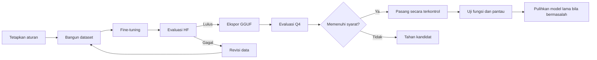

# Model dan Evaluasi

## Dua Jenis Kemampuan

Evaluasi memisahkan kemampuan baseline dan implisit agar hasil mudah dipertanggungjawabkan.

| Ruang | Fokus | Contoh |
| --- | --- | --- |
| Baseline | Perintah eksplisit dan pertanyaan status | “matikan lampu”, “berapa suhu ruangan?” |
| Implisit | Keluhan atau kondisi yang perlu disesuaikan dengan status perangkat | “ruangan panas”, “terlalu silau” |

Hasil baseline tidak dicampur dengan hasil implisit. Setiap laporan menyebutkan bagian data yang diuji, jumlah contoh, format model, cara menjalankan model, dan evaluator yang digunakan.

## Desain Dataset Implisit

Dataset aktif terdiri dari 12.000 data training, 1.200 data development, dan 1.200 frozen test. Setiap bagian seimbang antara contoh yang memerlukan aksi dan contoh tanpa aksi. Kategorinya meliputi perintah langsung, perintah implisit, pertanyaan status, kondisi yang sudah sesuai, dan permintaan yang harus ditolak.

Variasi ujaran mencakup:

- Kalimat singkat: “suhu ruangan panas”.
- Potongan ucapan dari STT: “terlalu silau”.
- Kalimat percakapan: “ruangannya terasa dingin”.
- Kalimat dengan konteks: “agak gelap buat baca”.

Generator menolak kalimat yang terdengar dibuat-buat, sapaan yang tidak diperlukan, dan kalimat yang sama pada bagian data yang berbeda.

## Metrik Utama

| Metrik | Makna |
| --- | --- |
| Tool exact match | Nama fungsi dan seluruh parameternya sama dengan jawaban acuan |
| No-tool accuracy | Model tidak mengusulkan aktuasi saat tidak diperlukan |
| Behavioral accuracy | Keputusan memenuhi kondisi tujuan yang telah ditetapkan |
| False execution | Model mengeksekusi pada contoh yang seharusnya no-tool |
| Schema-valid execution | Panggilan fungsi mengikuti format yang diperbolehkan |
| BERTScore | Kemiripan teks respons; metrik sekunder |

## Development dan Frozen Test

- **Development** dipakai untuk monitoring dan pemilihan checkpoint.
- **Frozen test** dikunci dan hanya digunakan untuk evaluasi akhir.
- Kesalahan pada frozen test tidak langsung dimasukkan kembali ke training tanpa membuat data uji akhir yang baru.
- Evaluator dan aturan penilaian ditetapkan sebelum model dijalankan agar skor tidak disesuaikan setelah hasil terlihat.

## Ringkasan Hasil Terverifikasi

| Model / format | Split | Tool exact | No-tool | Overall strict | Catatan |
| --- | --- | ---: | ---: | ---: | --- |
| Baseline candidate HF-F16 | Frozen 800 | 100,0% | 100,0% | 100,0% | False execution 0/400 |
| Baseline candidate Q4_K_M | Frozen 800 | 91,0% | 100,0% | 95,5% | 36 execute row tanpa native tool call |
| Implisit seed 20260817 HF-F16 | Frozen 1.200 | 87,33% | 99,33% | 93,33% | Behavioral 96,92%; 4 false execution |
| Implisit seed 20260817 Q4_K_M | Frozen 1.200 | — | 95,5% | — | Behavioral 94,08%; 27 false execution |
| Implisit dari baseline candidate HF-F16 | Frozen 1.200 | 90,17% | 100,0% | 95,08% | Behavioral 98,75%; implicit 95%; already-state 100%; false execution 0/600 |
| Implisit dari baseline candidate Q4_K_M | Frozen 1.200 | 86,0% | 100,0% | 93,0% | Behavioral 98,33%; implicit 93,33%; false execution 0/600; belum dipasang |

Angka baseline candidate dan kandidat implisit pada tabel telah dicocokkan dengan paket hasil lokal yang memuat metrics HF, metrics Q4, log, progress, manifest ekspor, dan ringkasan perbandingan HF-vs-Q4. Evaluasi Q4 keduanya dijalankan pada GPU NVIDIA L4 menggunakan format Q4_K_M. Artifact kandidat tetap dipisahkan dari model yang sedang aktif.

| Artifact kandidat Q4 | Jumlah frozen test | Ukuran artifact | Status |
| --- | ---: | ---: | --- |
| Baseline candidate | 800 | sekitar 505 MB | Evaluasi kanonik selesai; belum dipasang |
| Implisit dari baseline candidate | 1.200 | sekitar 505 MB | Evaluasi kanonik selesai; belum dipasang |

!!! warning "Cara mengutip hasil"
    Jangan menggunakan angka HF-F16 untuk mengklaim performa Q4. Jangan memakai BERTScore sebagai pengganti keberhasilan tool call atau keselamatan aktuasi. Model implisit Q4 yang terakhir terverifikasi aktif merupakan model seed 20260817; kandidat baru pada tabel belum dipasang.

## Tahapan Model Kandidat

