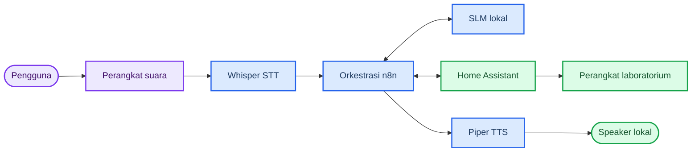
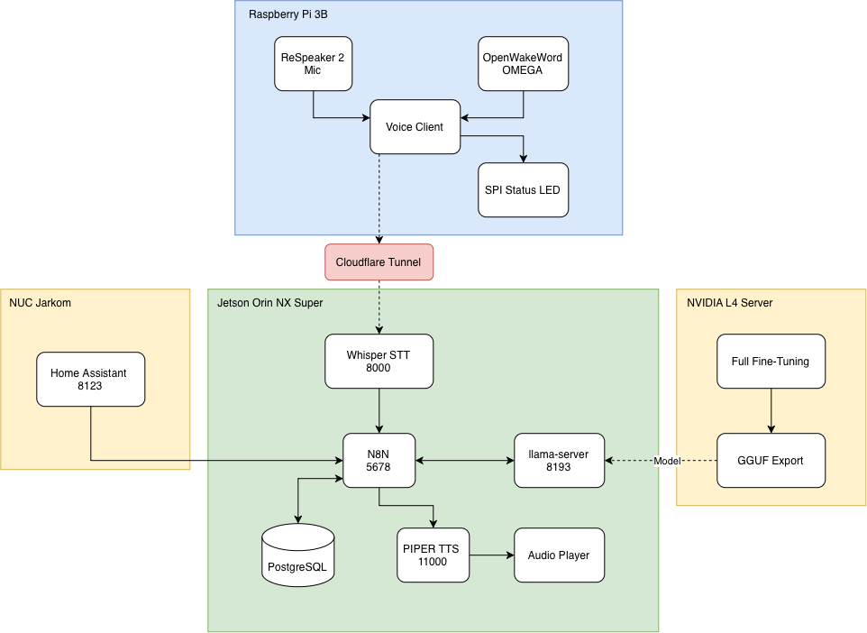

# Arsitektur Sistem

## Konteks Sistem

SmartLab membagi pekerjaan ke beberapa perangkat. Raspberry Pi menangani input suara, komputer utama menjalankan STT, n8n, SLM, dan TTS, sedangkan Home Assistant menghubungkan sistem dengan perangkat laboratorium. Training dilakukan pada komputer GPU yang terpisah dan tidak ikut menangani permintaan sehari-hari.

## Topologi Fisik

<figure markdown="span">
  
  <figcaption>Penempatan Raspberry Pi, komputer utama, Home Assistant, penyimpanan n8n, dan komputer training.</figcaption>
</figure>

!!! info "Inventaris terverifikasi"
    Label **Raspberry Pi 3B** pada gambar sudah benar. Perangkat aktif teridentifikasi sebagai **Raspberry Pi 3 Model B Rev 1.2** melalui `/proc/device-tree/model`.

## Peran Setiap Perangkat

| Node | Peran utama | Komponen |
| --- | --- | --- |
| Perangkat suara | Merekam audio dan menampilkan status proses | ReSpeaker 2-Mic, OpenWakeWord Omega, LED status |
| Komputer utama | Menjalankan pemrosesan suara dan pengambilan keputusan | STT, n8n, PostgreSQL, llama-server, Piper, pemutar audio |
| Home Assistant | Membaca status dan mengendalikan perangkat | Home Assistant Core dan integrasi perangkat |
| Komputer training | Melatih dan mengevaluasi model secara terpisah | Unsloth, evaluator, llama.cpp, ekspor GGUF |
