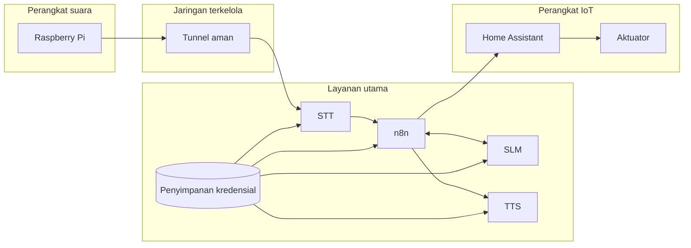

# Jaringan dan Keamanan

## Batas Akses Sistem

## Perlindungan yang Diterapkan

| Jalur | Mekanisme aplikasi | Prinsip |
| --- | --- | --- |
| Raspberry Pi → STT | Token pada header saat koneksi WebSocket | Raspberry Pi hanya menyimpan token STT |
| STT → n8n webhook | Header token khusus webhook | Terpisah dari token layanan lain |
| n8n → SLM | Bearer token | Endpoint model tidak dapat dipanggil tanpa token |
| n8n → TTS | Bearer token berbeda | Kebocoran satu token tidak membuka semua layanan |
| n8n → Home Assistant | Credential tersimpan terenkripsi | Tidak ditulis pada dokumentasi publik |

Kredensial disimpan dalam file konfigurasi lokal dengan izin akses terbatas. Nilai token tidak boleh dicetak ke log, dimasukkan ke ekspor alur n8n publik, atau disimpan di repositori dokumentasi.

## Token dan Pembatasan IP

Token memeriksa identitas aplikasi yang mengirim permintaan. Pembatasan IP menentukan jaringan atau alamat yang diizinkan mengakses layanan. Keduanya dapat digunakan bersama:

- **Token** cocok saat perangkat berpindah jaringan atau IP berubah.
- **Pembatasan IP** menambah perlindungan jaringan, tetapi perlu diperbarui ketika alamat berubah.
- **TLS/WSS** mengenkripsi koneksi; token dan pembatasan IP tidak menggantikan enkripsi.

## Aturan Publikasi

Dokumentasi publik tidak boleh memuat:

- Kata sandi, token, kunci privat, atau ID kredensial.
- IP internal, nama pengguna SSH, atau lokasi direktori pengguna.
- File `.env`, salinan basis data PostgreSQL, dan status mentah Home Assistant.
- Ekspor alur n8n yang masih menyimpan konfigurasi pemasangan.
- Tangkapan layar yang menampilkan token atau nilai kredensial.
