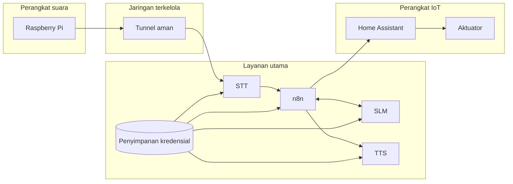

# Jaringan dan Keamanan

## Batas Akses Sistem

## Kontrol yang diterapkan

| Jalur | Mekanisme aplikasi | Prinsip |
| --- | --- | --- |
| Raspberry Pi → STT | Token pada header saat koneksi WebSocket | Raspberry Pi hanya menyimpan token STT |
| STT → n8n webhook | Header token khusus webhook | Terpisah dari token service lain |
| n8n → SLM | Bearer token | Endpoint model tidak dapat dipanggil tanpa token |
| n8n → TTS | Bearer token berbeda | Kompromi satu token tidak membuka semua service |
| n8n → Home Assistant | Credential tersimpan terenkripsi | Tidak ditulis pada dokumentasi publik |

Kredensial disimpan dalam file environment lokal dengan izin akses terbatas. Nilai token tidak boleh dicetak ke log, dimasukkan ke ekspor workflow publik, atau disimpan di repository dokumentasi.

## Token dan Pembatasan IP

Token memeriksa identitas aplikasi yang mengirim permintaan. Pembatasan IP menentukan jaringan atau alamat yang diizinkan mengakses layanan. Keduanya dapat digunakan bersama:

- **Token** cocok saat perangkat berpindah jaringan atau IP berubah.
- **Pembatasan IP** menambah perlindungan jaringan, tetapi perlu diperbarui ketika alamat berubah.
- **TLS/WSS** mengenkripsi koneksi; token dan allowlist tidak menggantikan enkripsi.

## Penguatan Keamanan Berikutnya

- Tambahkan batas jumlah dan ukuran permintaan.
- Buka layanan internal hanya pada antarmuka jaringan yang diperlukan.
- Rotasi credential lama secara terkontrol.
- Gunakan token pengujian terpisah untuk pentest dan cabut setelah pengujian.
- Hubungkan catatan antar-layanan menggunakan `trace_id` tanpa menyimpan nilai rahasia.

## Aturan Publikasi

Dokumentasi publik tidak boleh memuat:

- Password, token, private key, atau credential ID.
- IP internal, username SSH, atau path home pengguna.
- File `.env`, dump PostgreSQL, dan raw state Home Assistant.
- Workflow export yang masih menyimpan konfigurasi deployment.
- Screenshot browser yang menampilkan token atau nilai credential.
