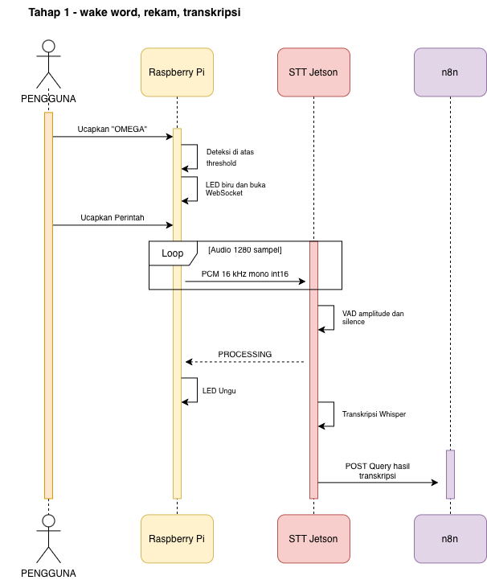
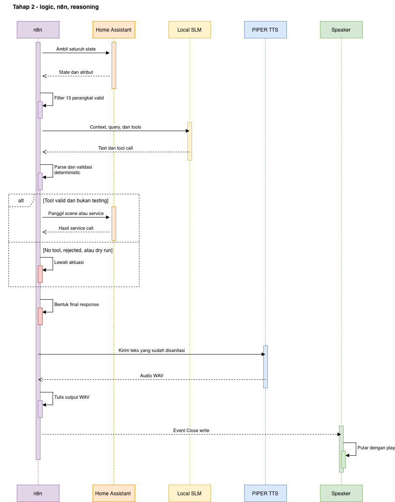
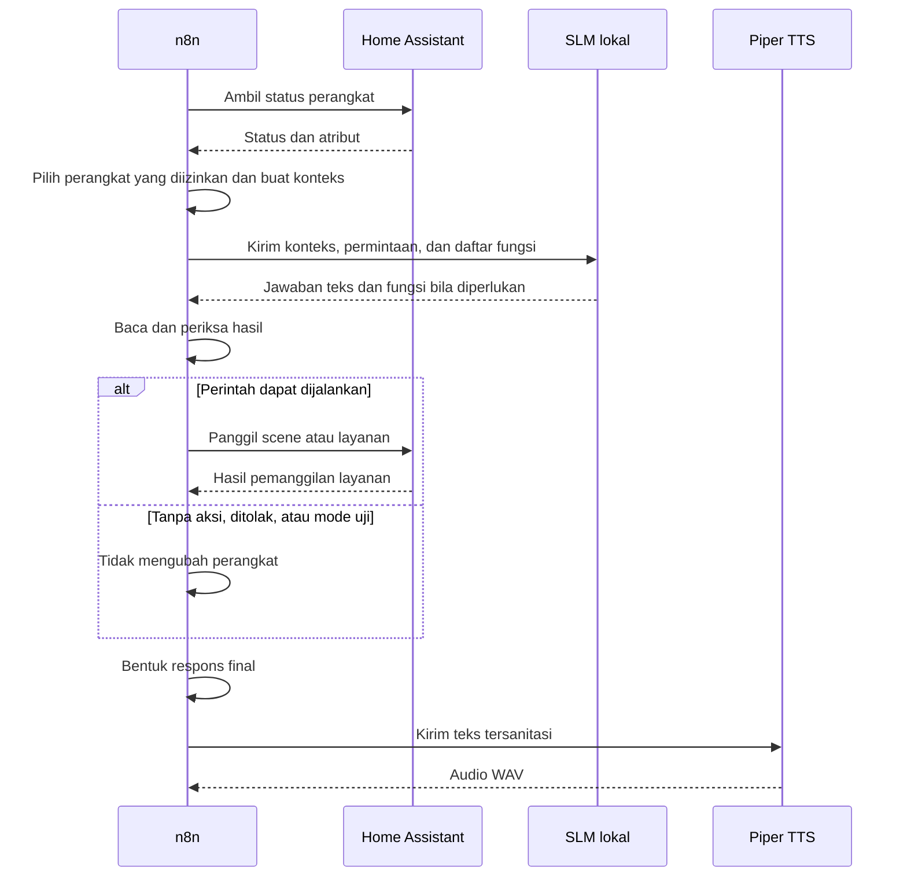

# Alur Proses SmartLab

## Tahap 1 — Dari Wake Word sampai Transkripsi

<figure markdown="span">
  
  <figcaption>Raspberry Pi mulai merekam setelah Omega terdeteksi. STT menentukan akhir ucapan, lalu meneruskan hasil transkripsi ke n8n.</figcaption>
</figure>

Urutan proses:

1. OpenWakeWord memantau audio lokal tanpa mengirimkannya ke server.
2. Skor Omega melewati ambang deteksi dan LED berubah dari siaga ke merekam.
3. Audio mono 16 kHz `int16` dikirim sebagai frame PCM melalui WebSocket aman.
4. STT mengumpulkan audio dan mendeteksi akhir ucapan.
5. STT mengirim sinyal `PROCESSING`, membuat transkripsi, lalu meneruskan teks ke webhook n8n.

## Tahap 2 — Dari Keputusan sampai Jawaban Suara

<figure markdown="span">
  
  <figcaption>n8n membaca kondisi perangkat, meminta keputusan dari SLM, memeriksa hasilnya, menjalankan aksi yang valid, dan membuat jawaban suara.</figcaption>
</figure>

## Status yang Dilihat Pengguna

| Status | Indikator | Makna |
| --- | --- | --- |
| Siaga | LED hijau | Menunggu wake word |
| Merekam | LED biru | Merekam perintah |
| Memproses | LED ungu | STT dan n8n sedang bekerja |
| Selesai | Kembali hijau | Sesi telah selesai |
| Gangguan koneksi | Pola khusus | Koneksi sedang dipulihkan |

## Batas Penggunaan Saat Ini

- Sistem saat ini mengutamakan satu permintaan aktif pada satu waktu.
- Jawaban suara diputar melalui speaker pada komputer utama, bukan dikirim kembali ke Raspberry Pi.
- Sistem belum dirancang untuk beberapa perangkat suara yang berbicara secara bersamaan.
- Respons berhasil dari Home Assistant menunjukkan bahwa layanan telah dipanggil. Keberhasilan fisik tetap perlu dilihat pada perangkat atau diperiksa melalui status terbaru.
